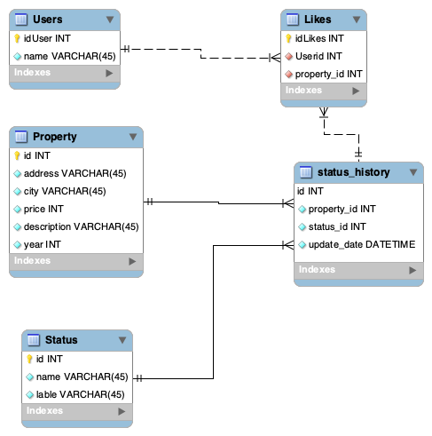

# habi_dt_test


Para construir el primer microservicio utlizaremos el framework Flask. No se utilizara un ORM (como sqlalchemy, SQLALchemy u otro por el estilo) para las consultas. Dentro de cada endpoint de la API tendremos un query statement para poder realizar consultas.

Utilizaremos el linter flake8 para ayudarnos a seguir la guia de estilo definida en PEP8.

Todas las dependencias se encuentran en requirements.txt.

## DUDAS:  
tenia la duda en la instruccion número 6 ¿se referia a guardar los filtros en un archivo json?. Asi que construí una funcion para esto. Puedes abrir el archivo filters.json despues de ejecutar una query con filtros, en ese archivo veras los parametros que manda el front

## Test driven development and unit tests
Recomiendo que lo primero que revisen sea mis unit test, ahi se encuentran testeadas las funcionalidades que se piden en la prueba. De igual manera si se revisa esto primero se entiende más rápido y fácil las principales funcionalidades de la API creada en Flask.
Las unit tests las realice con pytest.
Puedes correrlas abriendo la terminal y con el comando:  
```
python -m pytest -s -vv tests/test_api.py

```

o si quieres correr una en especifico como por ejemplo:test_get_resources:  

```
python -m pytest -s -vv tests/test_api.py::test_get_resources

```

## Ejecutar la app
Puede ejecutar en la terminal:  

```
./run.sh

```
En caso de no querer usar el run.sh puede lanzarla usted mismo. Solo asegurese de exportar la variable de ambiente y lanzar la app:  
```
export FLASK_APP=main.py
python app.py

```
## Visualizacion de la API
Revisar visualmente con Postman o en el explorador
puedes intentar con algunas de las siguientes URL o tu puedes crear la tuyo con gusto:

http://127.0.0.1:5000/inmuebles?city=pereira&year=2020&state=pre_venta

## Propuesta servicio de me gusta

Propongo la creación de dos tablas, una tabla de usuarios registrados y una tabla de likes, con la cual sabremos a que usuario le gusta la propiedad. Usando las llaves foraneas (id en Users y property_id en Property)



Las sentencias SQL para crear las tablas son:

````
CREATE TABLE Users(
    idUser int NOT NULL,
    name char NOT NULL,
    PRIMARY KEY (idUser)
);

CREATE TABLE Likes(
    idLikes int NOT NULL,
    PRIMARY KEY (idLikes),
    FOREIGN KEY (UserId) REFERENCES Users(idUser),
    FOREIGN KEY (property_id) REFERENCES Property(id)
);

```